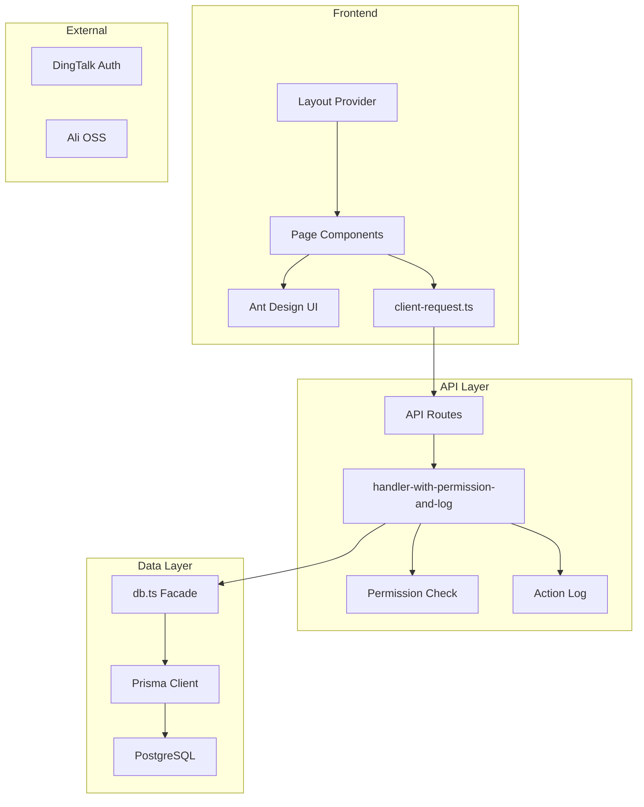

# 工程项目管理系统 - 全面审查报告

## 项目概览

| 项目 | 详情 |
|------|------|
| 技术栈 | Next.js 14.2 + React 18 + TypeScript + Prisma 5.22 + Ant Design 5 + TailwindCSS |
| 数据库 | PostgreSQL (via Prisma) |
| 认证 | 钉钉免登 + Cookie Session |
| 文件存储 | 阿里云 OSS |
| 部署 | PM2 + 自定义部署脚本 |
| 数据模型 | 27 个 Prisma Model，覆盖项目、合同、付款、报销、审批流程等 |

---

## 一、架构设计审查

### 1.1 整体架构 ✅ 合理

项目采用 Next.js App Router 的全栈架构，前后端同仓，API Routes 作为后端。对于中小型内部管理系统来说，这是合理的选择。



### 1.2 API 层分层 ⚠️ 存在冗余

当前有三套 API handler 包装器：
- `apiHandler` / `apiHandlerWithMethod` — 基础版
- `apiHandlerWithPermission` — 带权限
- `apiHandlerWithPermissionAndLog` — 带权限+日志

三者之间存在大量重复的错误处理逻辑（约 60 行几乎相同的 catch 代码在每个文件中重复）。建议合并为一个可组合的中间件链。

### 1.3 区域隔离 ✅ 设计良好

[`lib/region.ts`](lib/region.ts) 实现了完整的多区域数据隔离机制，通过 Cookie 存储当前区域，API 层自动注入 `regionId` 过滤条件。设计清晰。

---

## 二、安全性审查

### 2.1 🔴 严重：认证 Cookie 未加密签名

[`lib/auth.ts:38`](lib/auth.ts:38) 中，用户信息直接 JSON 序列化存入 Cookie：

```typescript
cookieStore.set(AUTH_COOKIE_NAME, userJson, {
  httpOnly: true,
  secure: process.env.NODE_ENV === 'production',
  sameSite: 'lax',
  maxAge: COOKIE_MAX_AGE,
  path: '/',
})
```

虽然设置了 `httpOnly`，但 Cookie 值是明文 JSON，没有加密或签名。攻击者如果能获取到 Cookie 值（如通过中间人攻击），可以伪造任意用户身份。

**建议**：使用 JWT 或 `iron-session` 等库对 Cookie 进行加密签名。

### 2.2 🔴 严重：文件上传缺少认证

[`app/api/upload/route.ts:78`](app/api/upload/route.ts:78) 的 `POST` handler 没有任何认证检查，任何人都可以上传文件到 OSS：

```typescript
export async function POST(req: NextRequest) {
  // 没有 auth check
  const formData = await req.formData()
  ...
}
```

**建议**：添加 `getCurrentUser()` 认证检查。

### 2.3 🟡 中等：权限正则匹配可能绕过

[`lib/api/permissions.ts`](lib/api/permissions.ts) 中的权限规则使用正则匹配路径，但部分正则使用了 `\[id\]` 字面量而非实际的动态路径段：

```typescript
pattern: /^\/api\/customers(\/\[id\])?$/,
```

实际请求路径是 `/api/customers/abc123`，不是 `/api/customers/[id]`。这意味着带 ID 的路径可能不会匹配到任何规则，从而走到默认的 `return true`（允许访问）。需要验证这些正则是否真的在生效。

### 2.4 🟡 中等：`application/octet-stream` 在上传白名单中

[`app/api/upload/route.ts:24`](app/api/upload/route.ts:24) 允许 `application/octet-stream` 类型，这是一个通用二进制类型，可能被用来上传可执行文件。

### 2.5 🟡 中等：系统管理员白名单暴露到前端

[`lib/env.ts:44`](lib/env.ts:44) 中 `NEXT_PUBLIC_SYSTEM_MANAGER_DING_USER_IDS` 作为公开环境变量暴露了管理员的钉钉 ID 列表。虽然用于前端菜单过滤，但暴露了敏感的用户标识。

---

## 三、性能审查

### 3.1 🟡 Prisma Client 日志级别

[`lib/prisma.ts:8`](lib/prisma.ts:8) 在所有环境下都开启了 `query` 日志：

```typescript
new PrismaClient({
  log: ['query'],
})
```

生产环境下会产生大量日志输出，影响性能。应该只在开发环境开启。

### 3.2 🟡 列表查询缺少分页

[`app/api/projects/route.ts:35`](app/api/projects/route.ts:35) 等 API 使用 `findMany` 不带分页参数，当数据量增长后会有性能问题：

```typescript
const projects = await db.project.findMany({
  where,
  orderBy: { createdAt: 'desc' },
  // 没有 take/skip
})
```

### 3.3 🟡 区域过滤的 N+1 查询

[`lib/region.ts:355`](lib/region.ts:355) 中 `filterResourceItemsByCurrentRegion` 对每个 item 都执行一次数据库查询来验证区域归属，存在 N+1 问题。

### 3.4 🟢 next.config.js 未做优化配置

[`next.config.js`](next.config.js) 是空配置，可以考虑添加：
- `output: 'standalone'` 优化部署体积
- 图片优化配置
- 安全 headers

---

## 四、代码质量审查

### 4.1 🟡 大量重复的错误处理代码

[`lib/api/handler.ts`](lib/api/handler.ts)、[`lib/api/handler-with-permission.ts`](lib/api/handler-with-permission.ts)、[`lib/api/handler-with-log.ts`](lib/api/handler-with-log.ts) 三个文件中有近乎相同的 catch 块（约 40-60 行），违反 DRY 原则。

### 4.2 🟡 TypeScript 类型安全不足

多处使用 `any` 类型：
- [`lib/api/handler.ts:11`](lib/api/handler.ts:11): `ApiHandlerFn` 返回 `Promise<any>`
- [`app/api/projects/route.ts:22`](app/api/projects/route.ts:22): `const where: any = {}`
- [`lib/region.ts:295`](lib/region.ts:295): `(db[model] as any).findFirst`

### 4.3 🟡 项目编码生成策略

[`app/api/projects/route.ts:104`](app/api/projects/route.ts:104) 使用时间戳生成编码：

```typescript
const code = `PRJ${Date.now()}`
```

在高并发场景下可能产生重复编码。建议使用数据库序列或更可靠的编码生成策略。

### 4.4 🟡 测试覆盖率极低

`tests/` 目录下只有 3 个测试文件：
- `attachments.test.ts`
- `db-column-compat.test.ts`
- `error-message.test.ts`

核心业务逻辑（审批流程、权限控制、区域隔离）完全没有测试覆盖。

### 4.5 🟢 前端页面组件过大

[`app/projects/page.tsx`](app/projects/page.tsx) 有 443 行，包含了列表、表单、移动端适配等所有逻辑。建议拆分为更小的组件。

---

## 五、可维护性审查

### 5.1 🟡 根目录文件过多

项目根目录有大量 markdown 文档（约 20+ 个），如 `ARCHITECTURE_ANALYSIS_PART1.md`、`PHASE2_COMPLETION_SUMMARY.md` 等，应该整理到 `docs/` 目录下。

### 5.2 🟡 SQL 备份文件不应提交到仓库

根目录有 3 个 `.sql` 备份文件（`backup_20260403_*.sql`），应该加入 `.gitignore`。

### 5.3 🟡 Feature Flags 是空壳实现

[`lib/feature-flags.ts`](lib/feature-flags.ts) 所有方法都返回 `false` 或抛出错误，是一个未完成的功能。如果不打算使用，应该移除以减少混淆。

### 5.4 🟢 API 层统一导出

[`lib/api/index.ts`](lib/api/index.ts) 提供了统一的导出入口，这是好的实践。

### 5.5 🟢 数据库访问层封装

[`lib/db.ts`](lib/db.ts) 提供了统一的数据库访问门面，便于后续替换或扩展。

---

## 六、问题优先级汇总

| 优先级 | 问题 | 类别 |
|--------|------|------|
| 🔴 P0 | Cookie 未加密签名，可伪造身份 | 安全 |
| 🔴 P0 | 文件上传接口无认证 | 安全 |
| 🟡 P1 | 权限正则可能未正确匹配动态路径 | 安全 |
| 🟡 P1 | 列表 API 缺少分页 | 性能 |
| 🟡 P1 | 测试覆盖率极低 | 质量 |
| 🟡 P2 | Prisma query 日志在生产环境开启 | 性能 |
| 🟡 P2 | API handler 错误处理代码重复 | 可维护性 |
| 🟡 P2 | 项目编码生成可能重复 | 可靠性 |
| 🟡 P2 | TypeScript any 类型过多 | 质量 |
| 🟡 P2 | 管理员 ID 暴露到前端 | 安全 |
| 🟡 P2 | upload 白名单含 octet-stream | 安全 |
| 🟡 P2 | 区域过滤 N+1 查询 | 性能 |
| 🟢 P3 | 根目录文件整理 | 可维护性 |
| 🟢 P3 | SQL 备份文件加入 gitignore | 可维护性 |
| 🟢 P3 | Feature Flags 空壳代码清理 | 可维护性 |
| 🟢 P3 | 页面组件拆分 | 可维护性 |
| 🟢 P3 | next.config.js 优化 | 性能 |

---

## 七、改进建议 TODO

以下是建议的改进任务清单，按优先级排序：

### P0 - 必须立即修复
- [ ] 将 auth Cookie 改为加密签名方案（推荐 iron-session 或 jose JWT）
- [ ] 为 `/api/upload` 添加认证检查
- [ ] 验证并修复权限正则匹配逻辑

### P1 - 尽快修复
- [ ] 为所有列表 API 添加分页支持（take/skip 或 cursor）
- [ ] 补充核心业务逻辑的单元测试（审批流程、权限控制、区域隔离）

### P2 - 计划修复
- [ ] Prisma 日志仅在开发环境开启
- [ ] 重构 API handler 层，抽取公共错误处理逻辑
- [ ] 改进项目编码生成策略（使用数据库序列）
- [ ] 减少 TypeScript any 使用，增强类型安全
- [ ] 将管理员判断逻辑移到服务端 API
- [ ] 从上传白名单移除 application/octet-stream
- [ ] 优化区域过滤的 N+1 查询

### P3 - 有空再做
- [ ] 整理根目录文档到 docs/
- [ ] SQL 备份文件加入 .gitignore
- [ ] 清理 Feature Flags 空壳代码
- [ ] 拆分大型页面组件
- [ ] 优化 next.config.js（standalone output、security headers）
